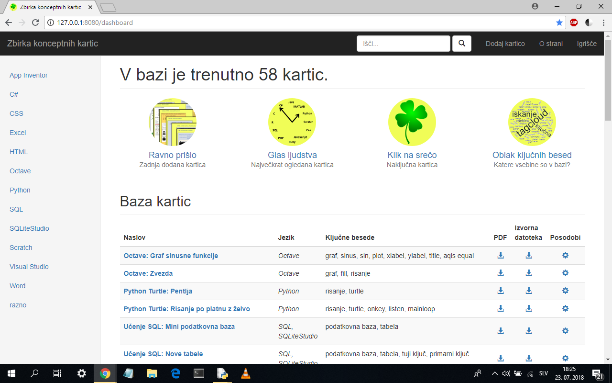

# Zbirka konceptnih kartic
Projektno delo: spletni vmesnik do baze podatkov s konceptnimi karticami, ki omogoča pregled, iskanje in dodajanje konceptnih kartic.

Opis
----

Baza podatkov vsebuje zbirko konceptnih kartic za učenje programskih jezikov in orodij (Python, Scratch, C#, ..., Octave, Excel, App Inventor, ...).

Spletna stran ponuja brskanje in iskanje po konceptnih karticah ter dodajanje novih konceptnih kartic v bazo.

ER diagram za bazo podatkov
---------------------------

Izgled spletnega vmesnika
---------------------------

Predviden izgled spletne strani - skica z Bootstrapovo predlogo "dashboard".

